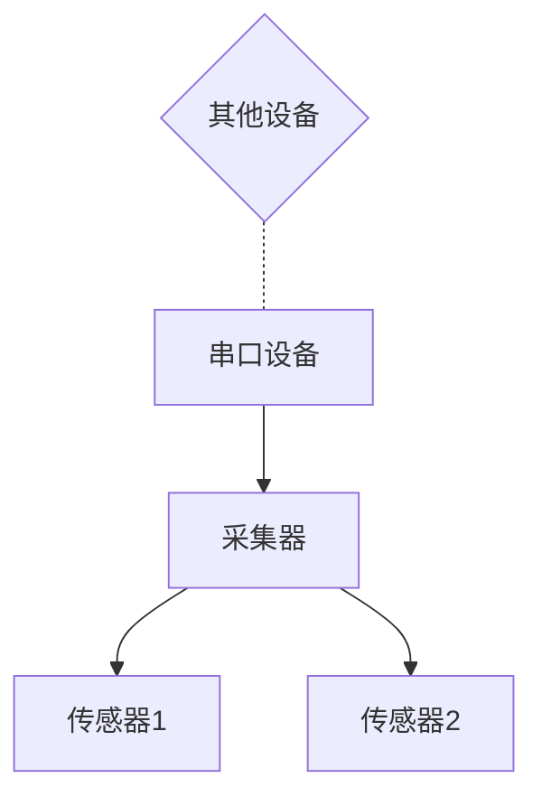
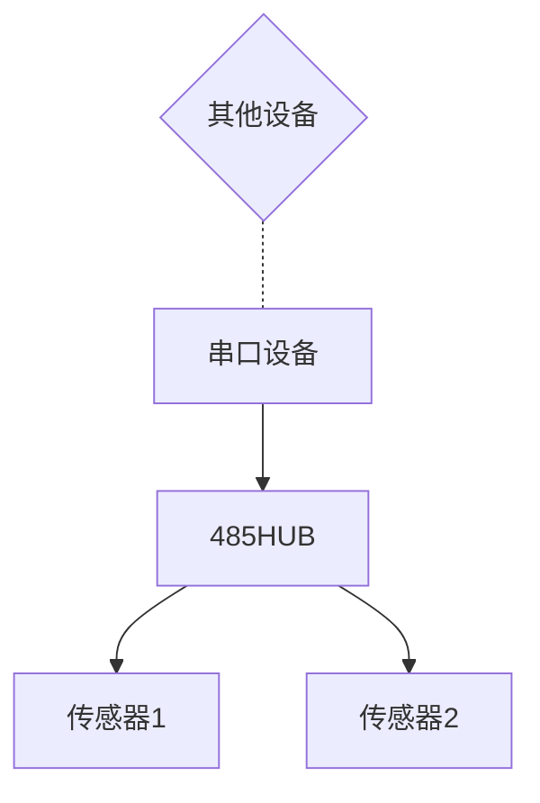
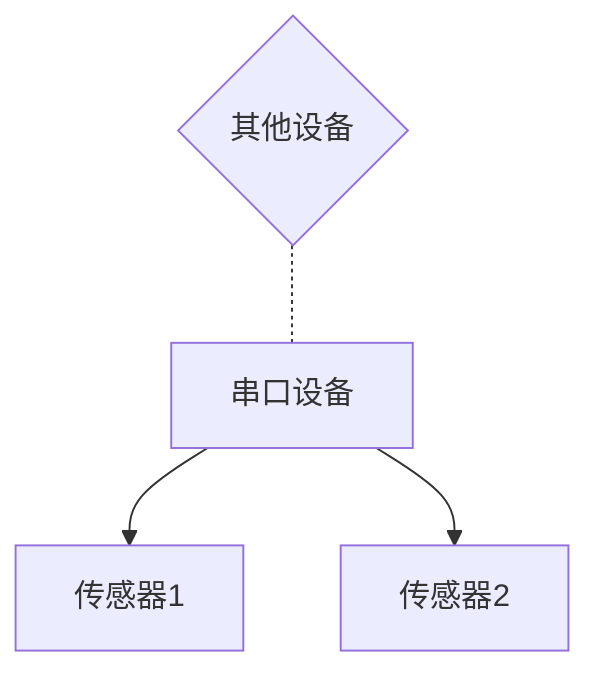

# 拓扑树策略

## 用于生成设备树所对应的NodeRed节点/逻辑的策略
包含两个部分

1. 设备树挂载新设备时生成NodeRed节点/逻辑(这部分后端管理)
2. 设备树挂载新设备时需要提供NodeRed节点生成的参数(需要前端表单提供)

## 设备不同的挂载方式

1.默认挂载顺序

```mermaid
graph TB
  Z{其他设备}
  A[串口设备]
  B[采集器]
  C1[传感器1]
  C2[传感器2]
  Z-.-A
  A-->B
  B-->C1
  B-->C2
```

2.485HUB挂载顺序

```mermaid
graph TB
  Z{其他设备}
  A[串口设备]
  B[485HUB]
  C1[传感器1]
  C2[传感器2]
  Z-.-A
  A-->B
  B-->C1
  B-->C2
```

3.传感器直连挂载顺序

```mermaid
graph TB
  Z{其他设备}
  A[串口设备]
  D1[传感器1]
  D2[传感器2]
  Z-.-A
  A-->D1
  A-->D2
```
